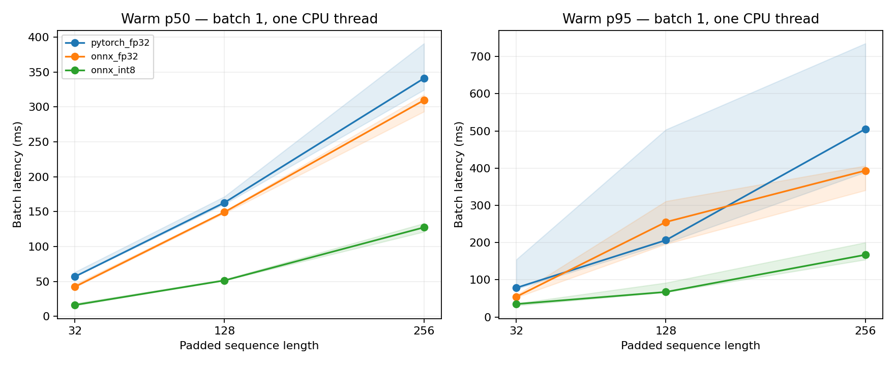
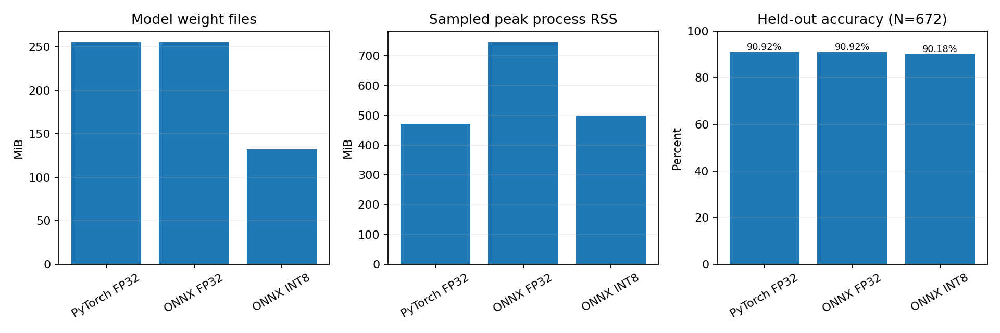

# Local CPU quantization study

Source run: `results/run-c75243a4ab6f`.

Measured on this Windows laptop. Results apply to this model, runtime, and workload only.

CPU: Intel(R) Core(TM) Ultra 9 185H
OS: Windows-11-10.0.26200-SP0
Power: Power Scheme GUID: 381b4222-f694-41f0-9685-ff5bb260df2e  (Balanced)

## Final held-out validation quality

| Variant | N | Accuracy | Macro F1 | Model weight MiB | Median idle RSS MiB | Median sampled peak RSS MiB |
| --- | ---: | ---: | ---: | ---: | ---: | ---: |
| pytorch_fp32 | 672 | 0.9092 | 0.9089 | 255.43 | 284.10 | 471.84 |
| onnx_fp32 | 672 | 0.9092 | 0.9089 | 255.53 | 734.71 | 745.83 |
| onnx_int8 | 672 | 0.9018 | 0.9014 | 132.43 | 482.18 | 499.12 |

INT8 minus ONNX FP32 accuracy: -0.744 percentage points; paired bootstrap 95% interval [-1.935, 0.446].
Changed predictions: 17. Point-estimate one-point gate passed: True.
This gate is a project criterion; a point estimate alone does not establish equivalence.
[Changed-prediction analysis](ERROR_ANALYSIS.md): 11 harmed and 6 helped predictions.

## Cached startup

Medians across fresh-process repetitions. Hash validation is outside load timing; tokenizer and model loading are inside it.

| Variant | Load ms | First 32-token inference ms |
| --- | ---: | ---: |
| pytorch_fp32 | 5392.40 | 153.11 |
| onnx_fp32 | 6533.66 | 45.25 |
| onnx_int8 | 6208.41 | 18.11 |

## Repeated device measurements

Values are medians of three per-process summaries, not pooled request percentiles.

| Variant | Scope | Batch | Padded length | p50 ms (min–max) | p95 ms (min–max) | Examples/s |
| --- | --- | ---: | ---: | ---: | ---: | ---: |
| onnx_fp32 | inference_only | 1 | 32 | 42.324 (41.619–45.663) | 54.310 (52.240–58.432) | 23.09 |
| onnx_fp32 | tokenization_plus_inference | 1 | 32 | 43.759 (41.721–45.650) | 70.320 (55.623–70.890) | 21.77 |
| onnx_fp32 | inference_only | 1 | 128 | 149.358 (147.735–150.635) | 255.188 (195.943–311.079) | 6.41 |
| onnx_fp32 | tokenization_plus_inference | 1 | 128 | 144.025 (136.924–146.942) | 195.451 (170.867–253.095) | 6.49 |
| onnx_fp32 | inference_only | 1 | 256 | 309.652 (293.378–317.552) | 393.331 (340.503–406.326) | 3.13 |
| onnx_fp32 | tokenization_plus_inference | 1 | 256 | 305.821 (286.509–306.959) | 367.681 (337.598–410.167) | 3.22 |
| onnx_int8 | inference_only | 1 | 32 | 16.200 (15.454–18.309) | 34.690 (30.777–36.180) | 51.62 |
| onnx_int8 | tokenization_plus_inference | 1 | 32 | 14.320 (14.127–15.299) | 21.774 (20.237–28.783) | 62.85 |
| onnx_int8 | inference_only | 1 | 128 | 51.370 (51.345–52.742) | 67.173 (66.213–91.856) | 18.55 |
| onnx_int8 | tokenization_plus_inference | 1 | 128 | 58.328 (55.141–59.384) | 78.068 (75.064–102.097) | 16.55 |
| onnx_int8 | inference_only | 1 | 256 | 127.388 (121.082–133.222) | 167.022 (154.062–200.106) | 7.50 |
| onnx_int8 | tokenization_plus_inference | 1 | 256 | 126.829 (117.094–130.355) | 154.930 (154.930–161.782) | 7.71 |
| pytorch_fp32 | inference_only | 1 | 32 | 56.880 (56.812–63.327) | 78.298 (75.082–154.375) | 16.71 |
| pytorch_fp32 | tokenization_plus_inference | 1 | 32 | 59.813 (58.513–66.141) | 93.303 (78.683–157.201) | 15.42 |
| pytorch_fp32 | inference_only | 1 | 128 | 162.986 (160.808–171.637) | 206.402 (198.555–503.675) | 5.96 |
| pytorch_fp32 | tokenization_plus_inference | 1 | 128 | 164.650 (161.774–166.873) | 222.505 (190.399–292.950) | 5.74 |
| pytorch_fp32 | inference_only | 1 | 256 | 341.043 (324.467–391.039) | 505.190 (389.366–735.161) | 2.88 |
| pytorch_fp32 | tokenization_plus_inference | 1 | 256 | 323.917 (293.860–334.431) | 441.870 (326.078–630.697) | 2.90 |

## Quantization effects

- Length 32, batch 1: ONNX FP32 / INT8 p50 = 2.61×.
- Length 128, batch 1: ONNX FP32 / INT8 p50 = 2.91×.
- Length 256, batch 1: ONNX FP32 / INT8 p50 = 2.43×.

ONNX weight-file size reduction: 48.2%. Sampled peak process RSS reduction relative to ONNX FP32: 33.1%. INT8 process RSS remains higher than PyTorch FP32 in this study; smaller weight files do not guarantee the lowest process memory.

ONNX FP32 improves median inference latency relative to PyTorch, but its 128-token median p95 is worse in this run. Runtime conversion is not a uniform improvement across metrics.

## Limitations and evidence

No thermal or energy measurement; background activity and OS scheduling can affect timings. Power scheme is recorded, not controlled programmatically. Warmup uses a fixed 20 calls; no statistical stationarity test is applied. First inference uses the 32-token scenario. Load time includes tokenizer and model loading after hash validation; artifacts were already cached.

The 10 ms sampler measures whole-process RSS and can miss brief peaks. Short/medium performance inputs rotate a bounded development pool, padded to scenario lengths. The 256-token workload repeats development text and is a synthetic stress fixture, not naturally long SST-2 text. This is not a representative production traffic study. No mobile, accelerator, container, or remote API performance is claimed.

The two timing scopes run sequentially. Variation can make tokenization-plus-inference appear faster than inference-only; subtracting these separate summaries does not measure tokenizer cost. p95 varies substantially in some scenarios, so tail-latency conclusions remain limited despite three repetitions.

Final accuracy uses a frozen validation-derived subset, not public test labels. The model and sentiment dataset have task-specific biases. INT8 leaves unsupported operators and embeddings in floating point. Input text and downloaded weights are excluded from Git.

Raw timings and hardware/artifact manifests: [run directory](../results/run-c75243a4ab6f/). Quality records: `results/quality-final-*.json`. FP32 parity: [parity evidence](../results/parity.json). Setup and commands: [reproduction guide](../docs/REPRODUCE.md).

Shaded latency ranges span the three observed repetition percentiles; they are not confidence intervals.

